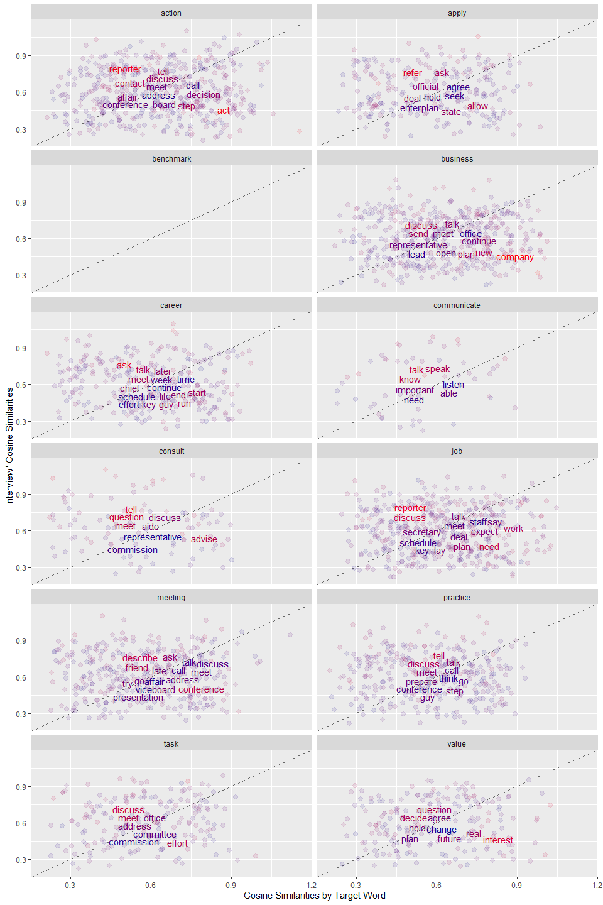
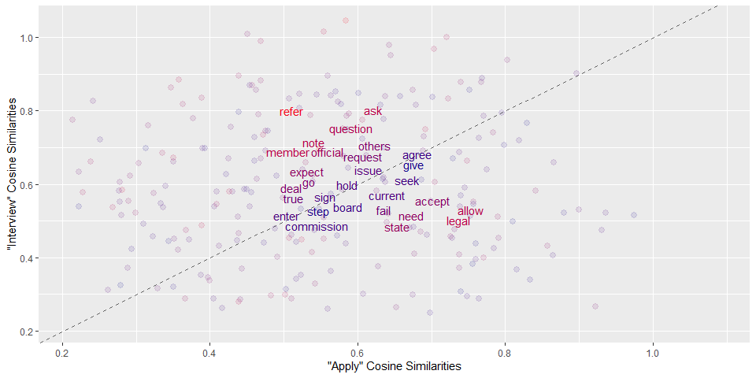

Analysis of Workplace-Themed Term Co-Occurrence Matrices
================
Ben Kubacki
13 December 2024

- [Read in data](#read-in-data)
- [Clean the data](#clean-the-data)
  - [Tidy columns](#tidy-columns)
  - [Filter POS to include only adjectives, nouns, and
    verbs.](#filter-pos-to-include-only-adjectives-nouns-and-verbs)
- [Build a TCM Matrix](#build-a-tcm-matrix)
  - [Tokens](#tokens)
  - [TCM Continued](#tcm-continued)
    - [Create vocabulary and
      vectorizer](#create-vocabulary-and-vectorizer)
    - [Create Term Co-occurrence Matrix and
      Vectors](#create-term-co-occurrence-matrix-and-vectors)
- [Seed List of Target Words](#seed-list-of-target-words)
  - [My own curated list](#my-own-curated-list)
- [Cosine similarities based on Term Co-Occurrence
  Matrix](#cosine-similarities-based-on-term-co-occurrence-matrix)
- [Visualizations](#visualizations)
  - [Plot by target word pairs](#plot-by-target-word-pairs)
    - [Check “question” output word against “interview” and “action”.
      Should be around 0.75 for
      each.](#check-question-output-word-against-interview-and-action-should-be-around-075-for-each)
  - [Overlap Between Output Words](#overlap-between-output-words)
- [Session info](#session-info)

# Read in data

> Data is already lemmatized and POS-tagged.

``` r
news_wlp <- c("data_private/wlp_newspaper_lsp/wlp_news_1990.txt",
           "data_private/wlp_newspaper_lsp/wlp_news_1991.txt",
           "data_private/wlp_newspaper_lsp/wlp_news_1992.txt",
           "data_private/wlp_newspaper_lsp/wlp_news_1993.txt",
           "data_private/wlp_newspaper_lsp/wlp_news_1994.txt",
           "data_private/wlp_newspaper_lsp/wlp_news_1995.txt",
           "data_private/wlp_newspaper_lsp/wlp_news_1996.txt",
           "data_private/wlp_newspaper_lsp/wlp_news_1997.txt",
           "data_private/wlp_newspaper_lsp/wlp_news_1998.txt",
           "data_private/wlp_newspaper_lsp/wlp_news_1999.txt",
           "data_private/wlp_newspaper_lsp/wlp_news_2000.txt",
           "data_private/wlp_newspaper_lsp/wlp_news_2001.txt",
           "data_private/wlp_newspaper_lsp/wlp_news_2002.txt",
           "data_private/wlp_newspaper_lsp/wlp_news_2003.txt",
           "data_private/wlp_newspaper_lsp/wlp_news_2004.txt",
           "data_private/wlp_newspaper_lsp/wlp_news_2005.txt",
           "data_private/wlp_newspaper_lsp/wlp_news_2006.txt",
           "data_private/wlp_newspaper_lsp/wlp_news_2007.txt",
           "data_private/wlp_newspaper_lsp/wlp_news_2008.txt",
           "data_private/wlp_newspaper_lsp/wlp_news_2009.txt",
           "data_private/wlp_newspaper_lsp/wlp_news_2010.txt",
           "data_private/wlp_newspaper_lsp/wlp_news_2011.txt",
           "data_private/wlp_newspaper_lsp/wlp_news_2012.txt") %>% 
  map_dfr(~read.delim(.x, header = FALSE, col.names = c("word", "lemma", "pos"), skipNul = TRUE, quote = ""))
  
nrow(news_wlp)
```

    [1] 108801619

``` r
news_wlp <- news_wlp %>% as_tibble()
```

# Clean the data

## Tidy columns

- Rename “word”, “lemma”, “pos”  
- Add document_id column  
- Fill document_id column NAs with document_id

``` r
## Add column marked by document number (when lemma & pos are NA), keep the rest NA

news_wlp <- news_wlp %>%
  mutate(document_id = ifelse(str_detect(word, "^##\\d{7}")==T, str_sub(word, 3,9), NA)) 

## Note: The following code was not put in the preceding pipe because of knitting issues.

## Replace NAs with document_id 
news_wlp <- news_wlp %>%
  fill(document_id)

unique(news_wlp$document_id) %>% length()
```

    [1] 57026

``` r
news_wlp %>% head()
```

    # A tibble: 6 × 4
      word      lemma pos     document_id
      <chr>     <chr> <chr>   <chr>      
    1 ##3000001 ""    ""      3000001    
    2 <p>       "<p>" "y"     3000001    
    3 He        "he"  "pphs1" 3000001    
    4 is        "be"  "vbz"   3000001    
    5 trying    "try" "vvg"   3000001    
    6 to        "to"  "to"    3000001    

## Filter POS to include only adjectives, nouns, and verbs.

> Compare full list against included list in code chunk

POS Tags [reference list](https://ucrel.lancs.ac.uk/claws7tags.html)

- Some data is marked with multiple POS (i.e., jj_nn)  
- Create regex separated by `|` to filter for all cases, including
  multiples  
- Punctuation is marked as “y” in COCA tags, so this step (not including
  “y”) should be sufficient to remove most punctuation, though not
  contractions

``` r
pos_keep <- c("jj|jk|nn|vv")

news_wlp <- news_wlp %>% 
  filter(str_detect(pos, pos_keep))

news_wlp %>% head()
```

    # A tibble: 6 × 4
      word   lemma pos     document_id
      <chr>  <chr> <chr>   <chr>      
    1 trying try   vvg     3000001    
    2 make   make  vvi     3000001    
    3 best   best  jjt_rrt 3000001    
    4 days   day   nnt2    3000001    
    5 seemed seem  vvn     3000001    
    6 pass   pass  vvi     3000001    

``` r
news_wlp %>% nrow()
```

    [1] 37333909

``` r
unique(news_wlp$document_id) %>% length()
```

    [1] 57026

Filtering the dataset to keep only adjectives, nouns, and verbs reduced
it to 37k rows from 108mil rows (more accurately, “words” now because
punctuation is removed by pos == “y”), but the number of documents is
still 57026.

# Build a TCM Matrix

Source of demo, including object names, code, and comments inside code:
(Selivanov,
2023)\[<https://cran.r-project.org/web/packages/text2vec/vignettes/glove.html>\]

## Tokens

In this step:

- Remove punctuation and contractions (may already be removed from POS
  filtering)  
- Normalize for capitalization by converting to lower case

``` r
## Create punctuation and contractions list to be removed just in case
stop_punctuation_regex <- "[\\,\\.\\:\\;\\*\\@\\'\\\"\\-\\$\\(\\)\\?]|(\\-\\-)|('s)|('d)|('t)|(n't)|('ve)|('re)|('ll)"

## Create tokens object as list

tokens <- news_wlp %>% select(document_id, lemma) %>% chop(lemma) %>% pull(lemma, document_id) #%>% 
  #as.list()

tokens <- map(tokens, ~ str_to_lower(str_subset(.x, stop_punctuation_regex, negate=T)))

## Output summary
summary(tokens) %>% head()
```

            Length Class  Mode     
    3000001   399  -none- character
    3000002   417  -none- character
    3000003   455  -none- character
    3000004   120  -none- character
    3000005   333  -none- character
    3000006   471  -none- character

``` r
## Output shows first element of list
tokens[[1]] %>% head(50)
```

     [1] "try"       "make"      "best"      "day"       "seem"      "pass"     
     [7] "like"      "month"     "day"       "visit"     "relative"  "spend"    
    [13] "afternoon" "fishing"   "wait"      "week"      "family"    "arrive"   
    [19] "beach"     "home"      "shore"     "wait"      "baseball"  "begin"    
    [25] "only"      "stillness" "owner"     "lockout"   "spring"    "camp"     
    [31] "week"      "keep"      "piniella"  "begin"     "tenure"    "new"      
    [37] "manager"   "red"       "seem"      "put"       "year"      "different"
    [43] "say"       "phone"     "recall"    "time"      "put"       "red"      
    [49] "uniform"   "look"     

## TCM Continued

- Iterator  
- Vocabulary & Remove Stopwords  
- Vectorizer  
- Term co-occurrence matrix  
- Word vectors

``` r
# Create iterators. Terms will be unigrams (simple words).
it <- itoken(tokens, progressbar = FALSE)

##Create and filter vocabulary for infrequent terms and stop-words

## Create stopwords

## Make table with tidytext "snowball" and tm "en" and my own additions
  
# tidytext
stop_words_snowball <- filter(stop_words, lexicon=="snowball") %>% select(word)

# tm::stopwords(kind = "en")

# My additions
my_stopwords <- c("also", "even", "one", "yet", "mr", "ms")

# Aggregated
stop_word_list <- c(stopwords(kind="en"), stop_words_snowball$word, my_stopwords)

stop_word_list <- unique(stop_word_list)

stop_word_list
```

      [1] "i"          "me"         "my"         "myself"     "we"        
      [6] "our"        "ours"       "ourselves"  "you"        "your"      
     [11] "yours"      "yourself"   "yourselves" "he"         "him"       
     [16] "his"        "himself"    "she"        "her"        "hers"      
     [21] "herself"    "it"         "its"        "itself"     "they"      
     [26] "them"       "their"      "theirs"     "themselves" "what"      
     [31] "which"      "who"        "whom"       "this"       "that"      
     [36] "these"      "those"      "am"         "is"         "are"       
     [41] "was"        "were"       "be"         "been"       "being"     
     [46] "have"       "has"        "had"        "having"     "do"        
     [51] "does"       "did"        "doing"      "would"      "should"    
     [56] "could"      "ought"      "i'm"        "you're"     "he's"      
     [61] "she's"      "it's"       "we're"      "they're"    "i've"      
     [66] "you've"     "we've"      "they've"    "i'd"        "you'd"     
     [71] "he'd"       "she'd"      "we'd"       "they'd"     "i'll"      
     [76] "you'll"     "he'll"      "she'll"     "we'll"      "they'll"   
     [81] "isn't"      "aren't"     "wasn't"     "weren't"    "hasn't"    
     [86] "haven't"    "hadn't"     "doesn't"    "don't"      "didn't"    
     [91] "won't"      "wouldn't"   "shan't"     "shouldn't"  "can't"     
     [96] "cannot"     "couldn't"   "mustn't"    "let's"      "that's"    
    [101] "who's"      "what's"     "here's"     "there's"    "when's"    
    [106] "where's"    "why's"      "how's"      "a"          "an"        
    [111] "the"        "and"        "but"        "if"         "or"        
    [116] "because"    "as"         "until"      "while"      "of"        
    [121] "at"         "by"         "for"        "with"       "about"     
    [126] "against"    "between"    "into"       "through"    "during"    
    [131] "before"     "after"      "above"      "below"      "to"        
    [136] "from"       "up"         "down"       "in"         "out"       
    [141] "on"         "off"        "over"       "under"      "again"     
    [146] "further"    "then"       "once"       "here"       "there"     
    [151] "when"       "where"      "why"        "how"        "all"       
    [156] "any"        "both"       "each"       "few"        "more"      
    [161] "most"       "other"      "some"       "such"       "no"        
    [166] "nor"        "not"        "only"       "own"        "same"      
    [171] "so"         "than"       "too"        "very"       "also"      
    [176] "even"       "one"        "yet"        "mr"         "ms"        

### Create vocabulary and vectorizer

**Add stopwords in argument in create_vocabulary function**??

**Determine if need to remove frequent terms**

- Don’t remove because some relevant content words

``` r
vocab <- create_vocabulary(it, stopwords = stop_word_list)


# vocab <- vocab %>% filter(!term %in% stop_word_list)

## Determine which max count you want to remove if any
# vocab %>% arrange(desc(term_count)) %>% head(100)

# Remove very infrequent terms using min term count =2
# add argument term_count_max = 170000L)

vocab <- prune_vocabulary(vocab, term_count_min = 2L)

vectorizer <- vocab_vectorizer(vocab)
```

### Create Term Co-occurrence Matrix and Vectors

``` r
tcm <- create_tcm(it, vectorizer, skip_grams_window = 5L)


glove <-  GlobalVectors$new(rank = 50, x_max = 10)

wv_main <-  glove$fit_transform(tcm, n_iter = 10, convergence_tol = 0.01, n_threads = 8)
```

    INFO  [15:12:00.291] epoch 1, loss 0.1575
    INFO  [15:12:12.387] epoch 2, loss 0.1150
    INFO  [15:12:25.649] epoch 3, loss 0.1059
    INFO  [15:12:39.474] epoch 4, loss 0.1013
    INFO  [15:12:54.001] epoch 5, loss 0.0984
    INFO  [15:13:08.266] epoch 6, loss 0.0964
    INFO  [15:13:22.308] epoch 7, loss 0.0949
    INFO  [15:13:36.163] epoch 8, loss 0.0937
    INFO  [15:13:49.640] epoch 9, loss 0.0928
    INFO  [15:14:03.063] epoch 10, loss 0.0920
    INFO  [15:14:03.064] Success: early stopping. Improvement at iterartion 10 is less then convergence_tol

``` r
wv_context = glove$components

word_vectors = wv_main + t(wv_context)
```

# Seed List of Target Words

1.  Web-scraped lists

**Promova**

``` r
promova_list <- read_html("https://promova.com/english-vocabulary/occupations-and-jobs-english-vocabulary") %>% 
  html_elements("li span") %>% 
  html_text()

promova_list <- promova_list[10:63] %>% 
  str_extract("^.+\\:") %>% 
  str_to_lower %>% 
  str_remove("\\:")

promova_list <- promova_list[27:54] 

promova_table <- promova_list %>% 
  tibble(word = `.`) 

stoplist <- c("cover letter", "job description", "background check", "probationary period", "job offer", "telecommuting/remote working", "salary expectations", "out of office")

promova_table <- promova_table %>% 
  filter(!word %in% stoplist)

promova_table$word <- promova_table$word %>% 
  str_remove("ing")
```

**Gorick**

``` r
gorick_list <- read_html("https://www.gorick.com/blog/workplace-jargon-dictionary")

gorick_list <- gorick_list %>%
  html_elements("h3") %>%
  html_text()

gorick_list <- gorick_list %>%
  str_remove("^.") %>%
  str_remove(".$")

gorick_list <- gorick_list %>% 
  str_subset("^[A-Z]{2,9}$", negate=T)

gorick_list <- gorick_list %>%
  tolower()
```

### My own curated list

**My own ideas with insight from gorick list**

- Used `writeLines()` in console to paste the seed_list_1 with 1
  appended into the next code chunk, and same with seed_list_2

``` r
seed_list <- c("meeting", "job", "interview", "apply", "communicate", "career", "task", "action", "value", "benchmark", "practice", "business", "consult") 

seed_list1 <- paste0(seed_list, "1")

seed_list2 <- paste0(seed_list, "2")

seed_list_sorted <- sort(c("meeting", "job", "interview", "apply", "communicate", "career", "task", "action", "value", "benchmark", "practice", "business", "consult"), decreasing=F) 
```

# Cosine similarities based on Term Co-Occurrence Matrix

Target word cosine similarities: target1

``` r
# map(seed_list, ~ sort(sim2(x = word_vectors, y = word_vectors[.x, , drop = FALSE], method = "cosine", norm = "l2"), decreasing = T)) %>% 
#   map(cos_seed_list, ~ as_tibble(.x, rownames="words")) %>% 
#   unlist()

meeting1 <- sim2(x = word_vectors, y = word_vectors["meeting", , drop=FALSE], method = "cosine", norm = "l2")[,0:1] %>% sort(decreasing = T)

job1 <- sim2(x = word_vectors, y = word_vectors["job", , drop=FALSE], method = "cosine", norm = "l2")[,0:1] %>% sort(decreasing = T)

interview1 <- sim2(x = word_vectors, y = word_vectors["interview", , drop=FALSE], method = "cosine", norm = "l2")[,0:1] %>% sort(decreasing = T)

apply1 <- sim2(x = word_vectors, y = word_vectors["apply", , drop=FALSE], method = "cosine", norm = "l2")[,0:1] %>% sort(decreasing = T)

communicate1 <- sim2(x = word_vectors, y = word_vectors["communicate", , drop=FALSE], method = "cosine", norm = "l2")[,0:1] %>% sort(decreasing = T)

career1 <- sim2(x = word_vectors, y = word_vectors["career", , drop=FALSE], method = "cosine", norm = "l2")[,0:1] %>% sort(decreasing = T)

task1 <- sim2(x = word_vectors, y = word_vectors["task", , drop=FALSE], method = "cosine", norm = "l2")[,0:1] %>% sort(decreasing = T)

action1 <- sim2(x = word_vectors, y = word_vectors["action", , drop=FALSE], method = "cosine", norm = "l2")[,0:1] %>% sort(decreasing = T)

value1 <- sim2(x = word_vectors, y = word_vectors["value", , drop=FALSE], method = "cosine", norm = "l2")[,0:1] %>% sort(decreasing = T)

benchmark1 <- sim2(x = word_vectors, y = word_vectors["benchmark", , drop=FALSE], method = "cosine", norm = "l2")[,0:1] %>% sort(decreasing = T)

practice1 <- sim2(x = word_vectors, y = word_vectors["practice", , drop=FALSE], method = "cosine", norm = "l2")[,0:1] %>% sort(decreasing = T)

business1 <- sim2(x = word_vectors, y = word_vectors["business", , drop=FALSE], method = "cosine", norm = "l2")[,0:1] %>% sort(decreasing = T)

consult1 <- sim2(x = word_vectors, y = word_vectors["consult", , drop=FALSE], method = "cosine", norm = "l2")[,0:1] %>% sort(decreasing = T)
```

Target word tables: target2

``` r
meeting2 <- as_tibble(meeting1, rownames="words") %>% 
  rename(cos_sim = value) %>%
  mutate(target = "meeting") %>% 
  filter(cos_sim < 1, cos_sim >= 0.5) %>% 
  filter(!str_detect(words, "meeting"))

job2 <- as_tibble(job1, rownames="words") %>% 
  rename(cos_sim = value) %>%
  mutate(target = "job") %>% 
  filter(cos_sim < 1, cos_sim >= 0.5) %>% 
  filter(!str_detect(words, "job"))

interview2 <- as_tibble(interview1, rownames="words") %>% 
  rename(cos_sim = value) %>%
  mutate(target = "interview") %>% 
  filter(cos_sim < 1, cos_sim >= 0.5) %>% 
  filter(!str_detect(words, "interview"))

apply2 <- as_tibble(apply1, rownames="words") %>% 
  rename(cos_sim = value) %>%
  mutate(target = "apply") %>% 
  filter(cos_sim < 1, cos_sim >= 0.5) %>% 
  filter(!str_detect(words, "apply"))

communicate2 <- as_tibble(communicate1, rownames="words") %>% 
  rename(cos_sim = value) %>%
  mutate(target = "communicate") %>% 
  filter(cos_sim < 1, cos_sim >= 0.5) %>% 
  filter(!str_detect(words, "communicate"))

career2 <- as_tibble(career1, rownames="words") %>% 
  rename(cos_sim = value) %>%
  mutate(target = "career") %>% 
  filter(cos_sim < 1, cos_sim >= 0.5) %>% 
  filter(!str_detect(words, "career"))

task2 <- as_tibble(task1, rownames="words") %>% 
  rename(cos_sim = value) %>%
  mutate(target = "task") %>% 
  filter(cos_sim < 1, cos_sim >= 0.5) %>% 
  filter(!str_detect(words, "task"))

action2 <- as_tibble(action1, rownames="words") %>% 
  rename(cos_sim = value) %>%
  mutate(target = "action") %>% 
  filter(cos_sim < 1, cos_sim >= 0.5) %>% 
  filter(!str_detect(words, "action"))

value2 <- as_tibble(value1, rownames="words") %>% 
  rename(cos_sim = value) %>%
  mutate(target = "value") %>% 
  filter(cos_sim < 1, cos_sim >= 0.5) %>% 
  filter(!str_detect(words, "value"))

benchmark2 <- as_tibble(benchmark1, rownames="words") %>% 
  rename(cos_sim = value) %>%
  mutate(target = "benchmark") %>% 
  filter(cos_sim < 1, cos_sim >= 0.5) %>% 
  filter(!str_detect(words, "benchmark"))

practice2 <- as_tibble(practice1, rownames="words") %>% 
  rename(cos_sim = value) %>%
  mutate(target = "practice") %>% 
  filter(cos_sim < 1, cos_sim >= 0.5) %>% 
  filter(!str_detect(words, "practice"))

business2 <- as_tibble(business1, rownames="words") %>% 
  rename(cos_sim = value) %>%
  mutate(target = "business") %>% 
  filter(cos_sim < 1, cos_sim >= 0.5) %>% 
  filter(!str_detect(words, "business"))

consult2 <- as_tibble(consult1, rownames="words") %>% 
  rename(cos_sim = value) %>%
  mutate(target = "consult") %>% 
  filter(cos_sim < 1, cos_sim >= 0.5) %>% 
  filter(!str_detect(words, "consult"))
```

Join the target word tibbles

``` r
## Join the target word tibbles

cos_tbl <- bind_rows(meeting2,
               job2, 
               interview2, 
               apply2,
               communicate2,
               career2,
               task2,
               action2,
               value2,
               benchmark2,
               practice2,
               business2,
               consult2)
```

Analyze top 15 words for each seed word

**Use this to present the data in the report**

Create top 15 output words per target word, longform

``` r
cos_tbl_15 <- cos_tbl %>% 
  group_by(target) %>% 
  slice(1:15)
```

``` r
cos_tbl_15_words <- cos_tbl_15 %>% 
  group_by(target) %>% 
  arrange(words) %>% 
  summarize(words = str_flatten(words, ", "))

cos_df_15_words <- as.data.frame(cos_tbl_15_words)

plot.textTable(textTable(cos_df_15_words, title = "Top 15 Output Words", subtitle = "Cosine Similarities in Descending Order by Target Word", row.names=F))
```

<figure>

<figcaption aria-hidden="true">15 Most Similar Words by Target
Word</figcaption>
</figure>

Write CSV

``` r
cos_tbl %>% 
  group_by(target) %>% 
  slice(1:100) %>% 
  write_csv("data/cosine_similarities.csv")
```

# Visualizations

## Plot by target word pairs

First we need to create a new table with the target word cosine
similarities in one column and the other target words in another column
with their cosines in another column.

**Target word Interview**

``` r
cos_tbl_interview <-
  cos_tbl %>% 
  pivot_wider(names_from = target, values_from = cos_sim) %>% 
  pivot_longer(cols = c(seed_list, -interview), names_to = "target", values_to = "cos_sim")
```

    Warning: Using an external vector in selections was deprecated in tidyselect 1.1.0.
    ℹ Please use `all_of()` or `any_of()` instead.
      # Was:
      data %>% select(seed_list)

      # Now:
      data %>% select(all_of(seed_list))

    See <https://tidyselect.r-lib.org/reference/faq-external-vector.html>.
    This warning is displayed once every 8 hours.
    Call `lifecycle::last_lifecycle_warnings()` to see where this warning was
    generated.

``` r
ggplot(cos_tbl_interview, aes(x = cos_sim, y = interview,
                          color = abs(interview - cos_sim))) +
  geom_abline(color = "gray40", lty = 2) +
  geom_jitter(alpha = 0.1, size = 2.5, width = 0.3, height = 0.3) +
  geom_text(aes(label = words), check_overlap = TRUE, vjust = 1.5) +
  scale_color_gradient(low = "darkblue", high = "red") +
  facet_wrap(~target, ncol = 2) +
  theme(legend.position="none") +
  labs(y = "\"Interview\" Cosine Similarities", x = "Cosine Similarities by Target Word")
```

    Warning: Removed 20017 rows containing missing values or values outside the scale range
    (`geom_point()`).

    Warning: Removed 20017 rows containing missing values or values outside the scale range
    (`geom_text()`).

<figure>

<figcaption aria-hidden="true">Comparing the Cosine Similarities of
Pairs of Target Words</figcaption>
</figure>

### Check “question” output word against “interview” and “action”. Should be around 0.75 for each.

``` r
cos_tbl %>% 
  filter(words == "question") %>% 
  arrange(desc(cos_sim))
```

    # A tibble: 12 × 3
       words    cos_sim target     
       <chr>      <dbl> <chr>      
     1 question   0.781 action     
     2 question   0.779 interview  
     3 question   0.670 meeting    
     4 question   0.641 job        
     5 question   0.627 practice   
     6 question   0.620 business   
     7 question   0.592 value      
     8 question   0.592 apply      
     9 question   0.591 task       
    10 question   0.542 career     
    11 question   0.512 consult    
    12 question   0.507 communicate

Indeed, “question” is between 0.77 and 0.78 similar to both “interview”
and “action”.

``` r
ggplot(filter(cos_tbl_interview, target == "apply"), aes(x = cos_sim, y = interview,
                          color = abs(interview - cos_sim))) +
  geom_abline(color = "gray40", lty = 2) +
  geom_jitter(alpha = 0.1, size = 2.5, width = 0.3, height = 0.3) +
  geom_text(aes(label = words), check_overlap = TRUE, vjust = 1.5) +
  scale_color_gradient(low = "darkblue", high = "red") +
  theme(legend.position="none") +
  labs(y = "\"Interview\" Cosine Similarities", x = "\"Apply\" Cosine Similarities")
```

    Warning: Removed 1688 rows containing missing values or values outside the scale range
    (`geom_point()`).

    Warning: Removed 1688 rows containing missing values or values outside the scale range
    (`geom_text()`).

<figure>

<figcaption aria-hidden="true">Comparing Interview &amp; Apply Similar
Words</figcaption>
</figure>

## Overlap Between Output Words

**Determine if there are output words that overlap between target words
when cosine \> 0.7. For example, are there words in the range of \>0.7
cos_sim that are the same for both “task” and “action”?**

- if we pivot wider, we can inspect the table to find words that have
  cos_sim values rather than NA  
- if we first filter out cos_sim \< 7, it will show us what we are
  working with  
- 

``` r
cos_wide <- cos_tbl %>% 
  filter(cos_sim>=.6) %>% 
  pivot_wider(names_from = target, values_from = cos_sim) 

cos_wide <- cos_wide %>% 
  mutate(na_count = rowSums(is.na(.))) %>% 
  filter(na_count < 12) %>% 
  arrange(na_count)

cos_wide
```

    # A tibble: 494 × 15
       words  meeting   job interview  apply communicate career   task action  value
       <chr>    <dbl> <dbl>     <dbl>  <dbl>       <dbl>  <dbl>  <dbl>  <dbl>  <dbl>
     1 agree    0.691 0.680     0.708  0.681          NA NA     NA      0.755  0.611
     2 impor…  NA     0.691     0.623  0.602          NA  0.614  0.646  0.712  0.716
     3 help    NA     0.818     0.602  0.609          NA  0.649  0.665  0.638 NA    
     4 change  NA     0.774     0.616  0.686          NA  0.600 NA      0.750  0.618
     5 give    NA     0.773     0.680  0.676          NA  0.647 NA      0.725  0.623
     6 part    NA     0.737     0.624 NA              NA  0.613  0.629  0.712  0.602
     7 focus   NA     0.672     0.624 NA              NA  0.613  0.683  0.744  0.607
     8 ask      0.673 0.717     0.829  0.622          NA NA     NA      0.693 NA    
     9 begin    0.672 0.701     0.697 NA              NA  0.652 NA      0.667 NA    
    10 expect   0.672 0.780     0.661 NA              NA  0.634 NA      0.688 NA    
    # ℹ 484 more rows
    # ℹ 5 more variables: benchmark <dbl>, practice <dbl>, business <dbl>,
    #   consult <dbl>, na_count <dbl>

The words that have the most overlap among the target words are (with
only five target words not matching):

- change  
- give  
- reason  
- important


# Session info

``` r
sessionInfo()
```

    R version 4.4.2 (2024-10-31 ucrt)
    Platform: x86_64-w64-mingw32/x64
    Running under: Windows 11 x64 (build 26100)

    Matrix products: default


    locale:
    [1] LC_COLLATE=English_United States.utf8 
    [2] LC_CTYPE=English_United States.utf8   
    [3] LC_MONETARY=English_United States.utf8
    [4] LC_NUMERIC=C                          
    [5] LC_TIME=English_United States.utf8    

    time zone: America/New_York
    tzcode source: internal

    attached base packages:
    [1] stats     graphics  grDevices utils     datasets  methods   base     

    other attached packages:
     [1] tablesgg_0.9-1  tm_0.7-14       NLP_0.3-0       cluster_2.1.6  
     [5] Rling_1.0       text2vec_0.6.4  tidytext_0.4.2  rvest_1.0.4    
     [9] readxl_1.4.3    lubridate_1.9.3 forcats_1.0.0   stringr_1.5.1  
    [13] dplyr_1.1.4     purrr_1.0.2     readr_2.1.5     tidyr_1.3.1    
    [17] tibble_3.2.1    ggplot2_3.5.1   tidyverse_2.0.0

    loaded via a namespace (and not attached):
     [1] gtable_0.3.6        xfun_0.49           lattice_0.22-6     
     [4] tzdb_0.4.0          vctrs_0.6.5         tools_4.4.2        
     [7] generics_0.1.3      curl_5.2.3          parallel_4.4.2     
    [10] fansi_1.0.6         highr_0.11          janeaustenr_1.0.0  
    [13] pkgconfig_2.0.3     tokenizers_0.3.0    Matrix_1.7-1       
    [16] data.table_1.16.2   lifecycle_1.0.4     farver_2.1.2       
    [19] compiler_4.4.2      munsell_0.5.1       RhpcBLASctl_0.23-42
    [22] htmltools_0.5.8.1   SnowballC_0.7.1     yaml_2.3.10        
    [25] pillar_1.9.0        crayon_1.5.3        rsparse_0.5.2      
    [28] tidyselect_1.2.1    digest_0.6.37       slam_0.1-54        
    [31] stringi_1.8.4       labeling_0.4.3      fastmap_1.2.0      
    [34] grid_4.4.2          colorspace_2.1-1    cli_3.6.3          
    [37] magrittr_2.0.3      utf8_1.2.4          withr_3.0.2        
    [40] scales_1.3.0        bit64_4.5.2         float_0.3-2        
    [43] timechange_0.3.0    rmarkdown_2.29      httr_1.4.7         
    [46] bit_4.5.0           mlapi_0.1.1         cellranger_1.1.0   
    [49] hms_1.1.3           evaluate_1.0.1      knitr_1.48         
    [52] rlang_1.1.4         Rcpp_1.0.13-1       glue_1.8.0         
    [55] selectr_0.4-2       xml2_1.3.6          vroom_1.6.5        
    [58] rstudioapi_0.17.1   lgr_0.4.4           R6_2.5.1           
    [61] tables_0.9.31      
