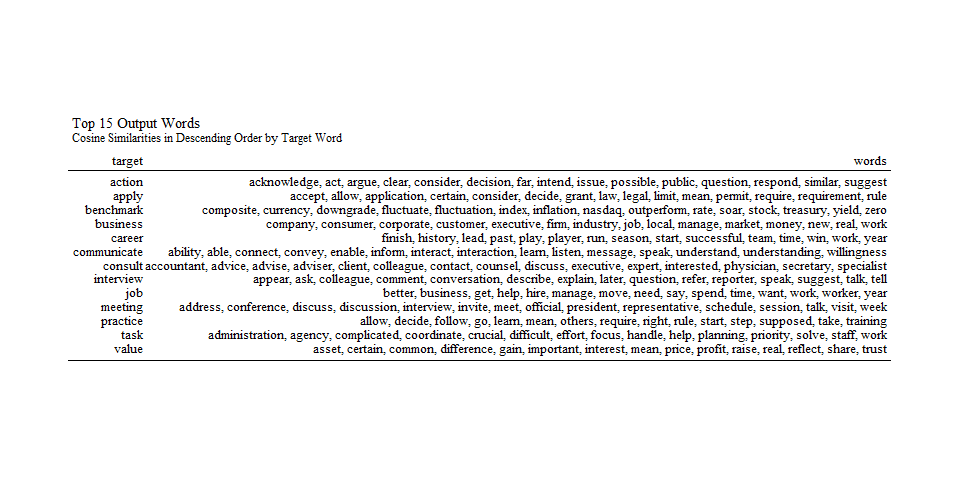
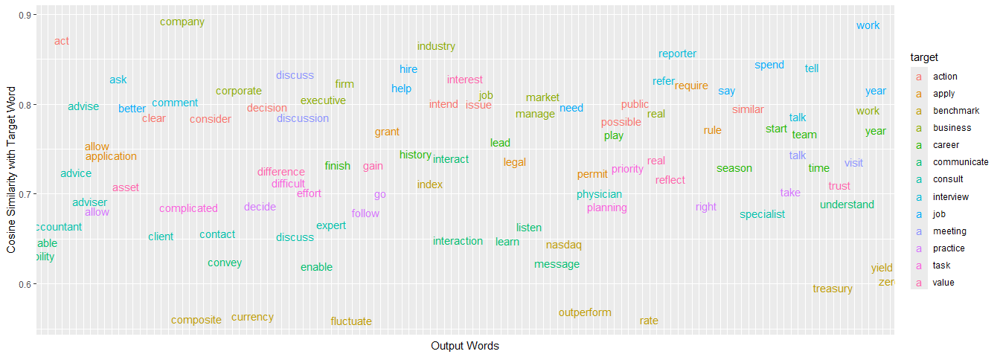
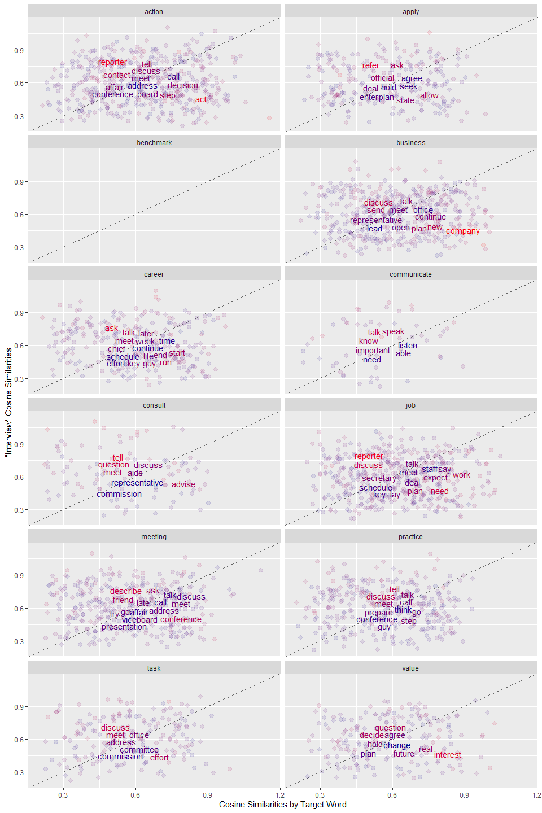

# Workplace English Context Words

**Ben Kubacki**

December 17, 2024

## Introduction

This project examined local word co-occurrences in a large corpus of 22 years of English newspaper texts to determine words related to common workplace terms. The goal of this project was to provide English learners and educators a means of finding contextualized workplace-related words by using vector semantics to analyze the COCA corpus. This goal aimed to contribute to contextualized vocabulary materials by helping learners and teachers select target words to optimize their learning efforts. The result was a list of words that co-occur with 13 target words in order of highest cosine similarity.

This area is important because vocabulary should not be considered rote memorization but contextualized and meaningful, as Brown and Lee point out (2015, p. 481). The authors note that collocations (close word pairs and combinations) and concordancing are also methods used to provide learners with lexical items in context. This current project used word co-occurrences to provide a more curated list of terms that can then be applied to learning of collocations, concordancing, and other authentic strategies.

## Research Questions and Hypotheses

The following research questions were investigated in this project:

1. What English words are most relevant for adult learners in occupational contexts?

1. What words co-occur with common workplace-related terms, and to what extent can these be beneficial for learners to focus their learning?

## Data

The data consisted of 57,026 newspaper texts from the Corpus of Contemporary American English (COCA) covering 22 years of data from 1990-2012. The datasets used in this project were data frames with variables Word, Lemma, and Part of Speech (POS). For example, the word “trying” was also recorded as “try” (Lemma) and “vvg” (-ing participle of lexical verb) (see UCREL). 

## Methods

To accomplish the goal, a term co-occurrence matrix (TCM) was created to find cosine similarities between a seed list of target words and output (co-occurring) words. Analyses were conducted to examine the output words with the highest cosine similarities to the target words, as well as output words that overlapped with multiple target words.

- The data was obtained through a University of Pittsburgh license with the owner of the corpus data.

- The data was imported, processed, cleaned, and analyzed in R  

- A lemmatized dataset was used, and only open-class parts of speech were used (specifically, adjectives, verbs, and nouns)

- A term co-occurrence matrix was used (Selivanov, 2023)  

- A target word list (n = 13) was created of common Workplace terms, by the author and several online sources (Promova; Ng, 2024) 

- Visualizations were made to analyze and describe the results  

- Results were written to a CSV file for sharing  

## Analysis

The words with the highest cosine similar ratings to each target word are displayed in Table X.

**Table 1.**

This table shows the words with the highest similarity to each target word based on cosine similarities. It demonstrates interesting results such as "consider" for the target word "action". It may not be obvious for a teacher of English, or a learner for that matter, to make use of the word "consider" in conjunction with "action", but the co-occurrence shows that learning this word would benefit the learner in a context in which "action" is frequently used. On the other hand, some of these words demonstrate proper nouns (i.e., nasdaq, cf. NASDAQ), and words that may be too context-specific for many purposes. Also, considering the learner does not know the specific context of the output words here, it provides a general direction in terms of practice. 

**Figure 1.**

Figure 1 shows the highly co-occurring words for each target word, in a colorful, spread-out display. The significant axis of comparison here is the cosine similarities on the y-axis. Each target word's commonly co-ocurring words are shown. This provides a different view of what is shown in Table 1.

**Figure 2.**

Here, a comparison of the highest cosine similarity output words are shown for each target word in comparison to the word "interview". The Figure shows the ways that a single target word's output can be compared against other target words' outputs. This could be useful in a case where a learner is applying for a job and preparing for an interview. Which words are highly co-occurring for both of these words? See Figure 3 for a more specific examination.

**Figure 3.**

This figure shows that "refer" co-occurs highly with "interview" and "allow" co-occurs with "apply", but "agree" seems to be relatively high for both words. Thus, practicing the use of the word "agree" and "agreement" might be beneficial leading up to a job interview.

## Conclusion

The results show that word co-occurrences can point to helpful related words that can help learners focus learning efforts, especially before an interview ("interview"), when applying for a job ("apply"), or when seeking a job that involves meetings ("meeting"). The output words that co-occur with the target words can save learners time and stress when trying to decide which words are most beneficial. However, it should be emphasized that merely memorizing words is not recommended; rather, using words in context and practicing both listening and speaking in communication are crucial.

### Project history and process

The rationale behind this project shifted soon after the start from comparing the usefulness of target Workplace word lists to retrieving co-occurrences from a simple target word list. The process of obtaining the data was complicated, and I shifted my data from OneDrive to my local drive to facilitate coding. The restrictions on the sharing of data meant ensuring that I was very careful in pushing commits to GitHub. And the process of reading in the data involved much trial and error. It was helpful to have a demonstration by Selivanov of how to create a term co-occurrence matrix, though I attempted multiple times to create a document-term matrix, a project for the near future. And finally, much of the work was spent on the data processing more than the analysis, so there is much left to explore in the analysis of the data.

## References

Brown, H. D. & Lee, H. (2015). _Teaching by principles: An interactive approach to language pedagogy. (4th ed.). Pearson Education, Inc.

Davies, M. (2008). The Corpus of Contemporary American English. Available online at http://corpus.byu.edu/coca/.

Jurafsky & Martin. 2024. Vector Semantics & Embeddings. In _Speech and Language Processing_ (Chapter 6).

Ng, G. (2024). _Workplace Jargon Dictionary._ https://www.gorick.com/blog/workplace-jargon-dictionary

Handford. 2017. Corpus Linguistics. In _The Routledge Handbook of Language in the Workplace_.  

Levshina, N. (2015). Natalie Levshina. _How to Do Linguistics with R_.

Promova. _Occupations and Jobs English Vocabulary_ https://promova.com/english-vocabulary/occupations-and-jobs-english-vocabulary

Selivanov, D. (2023). _GloVe Word Embeddings._ https://cran.r-project.org/web/packages/text2vec/vignettes/glove.html

_English-Corpora.org COCA._ https://www.english-corpora.org/coca.  

_COCA Help Files._ https://www.english-corpora.org/help/.

_COCA: Five minute tour: pdf with images._ https://www.english-corpora.org/coca. 

UCREL. UCREL CLAWS7 Tagset. https://ucrel.lancs.ac.uk/claws7tags.html 
